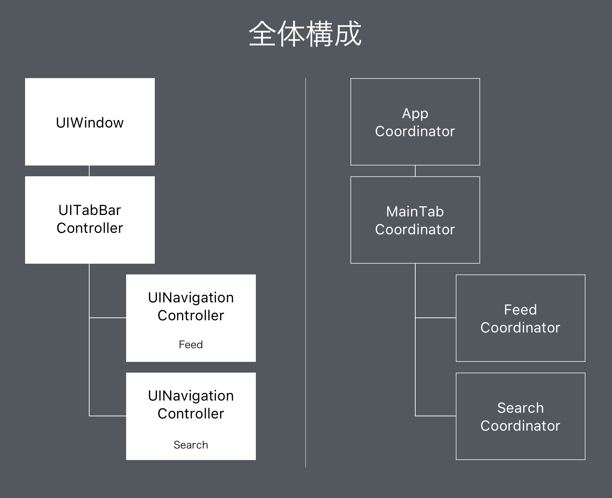

autoscale: true
slidenumbers: true

# Coordinatorパターンの実践
### <br><br>@yoshikuni_kato
#### potatotips #38<br>2017/03/22

---
# Who am I?


- 加藤由訓（Yoshikuni Kato） [@yoshikuni_kato](https://twitter.com/yoshikuni_kato)
- iOSエンジニア
- Yahoo! Japan -> オハコ
- 「ラジへぇ」くん →
- Interests: 設計 / FRP / Coordinator Pattern / UI実装

---
# Agenda
- Coordinatorパターンの実装例を紹介したい
- Coordinator: 画面遷移のロジックをVCから切り出したもの
  - 過去の資料（[画面遷移の管理とMVVM](https://speakerdeck.com/yoching/hua-mian-qian-yi-falseguan-li-tomvvm)）を参照ください

^ Coordinatorの実装例を紹介したい

---
# ソースコード

[https://github.com/yoching/CoordinatorSample](https://github.com/yoching/CoordinatorSample)

---


^ 例として作ったアプリです

---


^ Viewの構成に合わせてCoordinatorを設計する

---
# Coordinatorの作成単位
- 「中に複数のVCを持つVC」単位でCoordinatorを作ると分かりやすい
  - UINavigationController
  - UITabBarController
  - containerViewを利用しているViewController
- UX的な分割とも一致するはず

^ nav / tab / containerView単位でつくることになる

<!--
- 「windowのrootVCは変えない方がいい」という話　→　containerViewを持つVCに対応するCoordinatorを
- presentする場合は、present**元**のVCに対応するCoordinatorのchildCoordinatorとする
- windowが複数ある場合、AppCoordinatorで対応する
-->

---
# Coordinator protocol
```swift
protocol Coordinator {
    var presenter: UIViewController { get }
    func start()
}
```

^ presenterとstart

---
# NavigationCoordinator protocol
```swift
protocol NavigationCoordinator: Coordinator {
    var navigationController: UINavigationController { get }
}

extension NavigationCoordinator {
    var presenter: UIViewController {
        return navigationController as UIViewController
    }
}
```

^ presenterとしてnavigationController

---
# TabBarCoordinator protocol
```swift
protocol TabBarCoordinator: Coordinator {
    var tabBarController: UITabBarController { get }
}

extension TabBarCoordinator {
    var presenter: UIViewController {
        return tabBarController as UIViewController
    }
}
```

^ presenterとしてtabBarController

---
# AppCoordinator
```swift
final class AppCoordinator {
    private let window: UIWindow
    private let rootCoordinator: Coordinator
    init(window: UIWindow, rootCoordinator: Coordinator) {
        self.window = window
        self.rootCoordinator = rootCoordinator
    }
    func start() {
        rootCoordinator.start()
        window.rootViewController = rootCoordinator.presenter
        window.makeKeyAndVisible()
    }
}
```

^ rootViewControllerに対応するCoordinatorを受け取る仕組み

---
# MainTabCoordinator
```swift
final class MainTabCoordinator: TabBarCoordinator {
    let tabBarController: UITabBarController
    private let childCoordinators: [Coordinator]
    init(presenter: UITabBarController, childCoordinators: [Coordinator]) {
        self.tabBarController = presenter
        self.childCoordinators = childCoordinators
    }
    func start() {
        childCoordinators.forEach { coordinator in
            coordinator.start()
        }
        tabBarController.setViewControllers(
            childCoordinators.map { $0.presenter },
            animated: false
        )
    }
}
```

^ childCoordinatorを配列で受け取る


<!--
---
# SearchCoordinator
```swift
final class SearchCoordinator: NavigationCoordinator, DetailsPresentable {
    let navigationController: UINavigationController
    init(presenter: UINavigationController) {
        self.navigationController = presenter
        presenter.title = "Search"
    }
    func start() {
        let searchViewController = StoryboardScene.SearchViewController.initialViewController()
        searchViewController.searchTapped = showSearchResult
        navigationController.pushViewController(searchViewController, animated: false)
    }
    private func showSearchResult() {
        let resultViewController = StoryboardScene.SearchResultViewController.initialViewController()
        resultViewController.itemSelected = showItemDetail
        navigationController.pushViewController(resultViewController, animated: true)
    }
}
```
-->

---
# 2つのNavigationで共通する遷移がある

- 遷移


　→ protocol-orientedに解決

^ protocol-orientedに解決してみる

---
# DetailsPresentable protocol
```swift
protocol DetailsPresentable {
    func showItemDetail(item: Item)
    func showUserDetail(user: User)
}
```

^ 共通処理を宣言

---
# DetailsPresentable extension
```swift
extension DetailsPresentable where Self: NavigationCoordinator {
    func showItemDetail(item: Item) {
        let itemDetailVC = StoryboardScene.ItemDetailViewController.initialViewController()
        itemDetailVC.item = item
        itemDetailVC.userTapped = showUserDetail
        navigationController.pushViewController(itemDetailVC, animated: true)
    }

    func showUserDetail(user: User) {
      // ...
    }
}
```

※ VC→Coordinatorの通信は、closureを介す / delegate / Observable(FRP) など

^ デフォルト実装する

---
# FeedCoordinator
```swift
final class FeedCoordinator: NavigationCoordinator, DetailsPresentable {

    let navigationController: UINavigationController

    init(presenter: UINavigationController) {
        self.navigationController = presenter
        presenter.title = "Feed"
    }

    func start() {
        let feedViewController = StoryboardScene.FeedViewController.initialViewController()
        feedViewController.itemSelected = showItemDetail
        navigationController.pushViewController(feedViewController, animated: false)
    }
}
```

^ 各Coordinatorは差分（大体の場合最初の画面）だけ

---
# Summary

- Coordinatorの作成例の紹介
  - [https://github.com/yoching/CoordinatorSample](https://github.com/yoching/CoordinatorSample)
  - どう分割するか
- 共通処理をprotocol-orientedに解決する

---
# [fit] Thank you!   

---
# 参考

- [画面遷移の管理とMVVM](https://speakerdeck.com/yoching/hua-mian-qian-yi-falseguan-li-tomvvm)
- [Presenting Coordinators](https://vimeo.com/144116310) by Soroush Khanlou, NSSpain(2015)
- [Boundaries in Practice](https://realm.io/news/tryswift-ayaka-nonaka-boundaries-in-practice/) by Nonaka Ayaka, try!Swift(2016)
- [MVVM-C In Practice](https://speakerdeck.com/macdevnet/mvvm-c-in-practice) by Steve Scott, UIKonf(2016)
- [Connecting View Controllers](https://talk.objc.io/episodes/S01E05-connecting-view-controllers) at Swift Talk(objc.io), 2016
