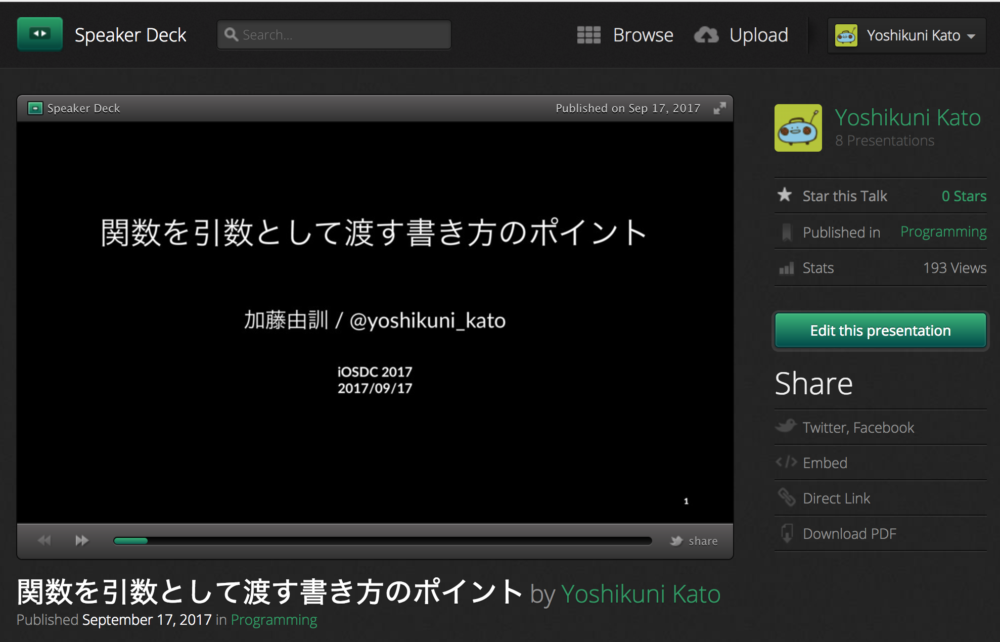
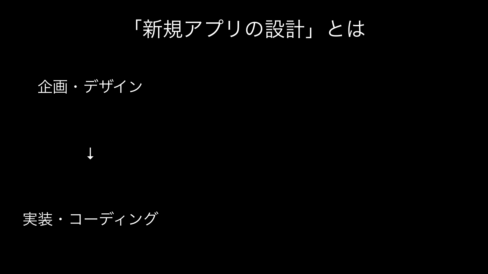
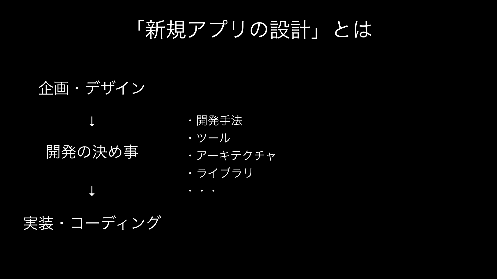
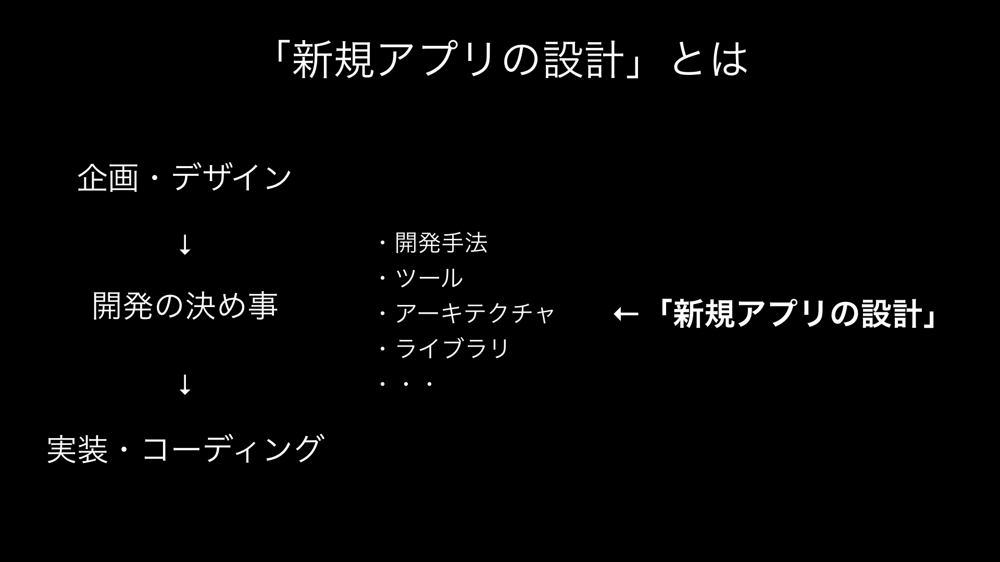
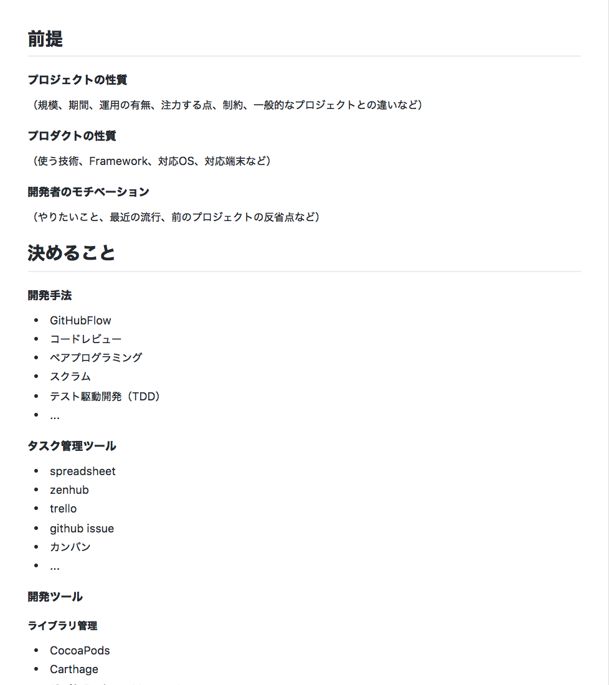
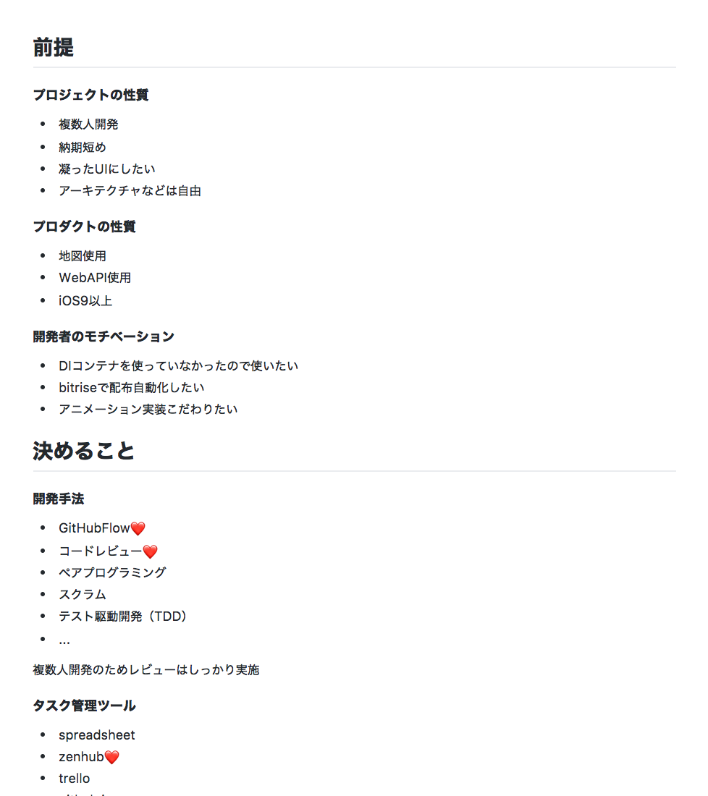

autoscale: true
slidenumbers: true

# 「新規アプリの設計」を設計する
###   @yoshikuni_kato
#### 俺コン Vol.1 2017/10/02

---
# Who am I ?

- Yoshikuni Kato（加藤由訓） [@yoshikuni_kato](https://twitter.com/yoshikuni_kato)
- iOS Engineer（2.5 years）
- Yahoo! Japan -> OHAKO
- Radi-Hey →

---
# Presentation at iOSDC 2017 [^1]

[^1]: https://speakerdeck.com/yoching/guan-shu-woyin-shu-tositedu-sushu-kifang-falsepointo

---

---

---

---
# 今日の話 -「新規アプリの設計」を設計する

「新規アプリの設計」フェーズについて、以下の点を検討（≒設計）してきた

- 何を決めるか
- どの観点から決めるか

※ あくまでも一例で、今後、こういう議論をしていきたい

---
# 設計を重視する理由

- 実装時にありがちな問題
  - 「あれ、このライブラリ足りない」が後で発覚する
  - 決めたことに後悔する（ちゃんと考えておけば・・・）
  - 新メンバーに伝えることが多い & 一度に伝えられない

 
→ 先に検討できる箇所はしておく
　検討内容・結果をドキュメント化しておく

---
# 自分の経験

- 受託開発で、0からの開発を繰り返す
- xcodeproj を作る前に、開発方針のドキュメントを作成（Markdownなど）
- 検討項目自体、毎回アップデートする

 
このドキュメントのフォーマットを共有する
→ このフェーズに関する知見・議論を増やしていきたい

---
# 新規iOSアプリ実装前に決めることリスト

- githubで公開しました
- yoching/iOSAppDevelopmentPreparationList [^2]

[^2]: https://github.com/yoching/iOSAppDevelopmentPreparationList

---
# 使用例

- 前提条件を書き出す
- 選択肢の中でどれを実際に選択したかとその理由を書く

---
# 何を決めるか

---
# 項目一覧

- 開発手法
- タスク管理ツール
- 開発ツール
- ライブラリ
- アーキテクチャ / デザインパターン
- フレームワークの分割
- コーディング規約
- やりたい書き方
- 参考にするアプリ

---
# 詳しくはGitHubで

- yoching/iOSAppDevelopmentPreparationList [^2]

[^2]: https://github.com/yoching/iOSAppDevelopmentPreparationList

---
# どの観点から決めるか

---
# どの観点から決めるか - 3つの前提条件

1. プロジェクトの性質
1. プロダクトの性質
1. 開発者のモチベーション

 
これらの条件を複合的に判断して決める

---
# 条件１ - プロジェクトの性質

- 規模
- 期間
- 開発メンバー
- その後の運用体制
- 注力する点
- 制約の有無
- このプロジェクト特有の点 / 一般的な点

---
# 条件２ - プロダクトの性質

- 対応OS
- 使う技術
  - ネットワーク通信の有無
  - DBの有無
  - Framework
  - ...

---
# 条件３ - 開発者のモチベーション

- やってみたいこと
- 最近の流行
- 前のプロジェクトの反省点

 
プロジェクトと直接関係なさそうでも書き出してみると良い
各メンバーの意見を出し合う

---
# どの観点から決めるか - 3つの前提条件

1. プロジェクトの性質
1. プロダクトの性質
1. 開発者のモチベーション

 
これらの条件を**複合的に**判断して決める

^ 最近の案件でreduxの採用を見送った話

---
# まとめ

- 新規アプリの設計（開発の決め事）について考えていることとそのリストを共有
- 今後、こういう議論をして、コミュニティ的に知見をためていきたい

---
# 参考

- Building Fabric.app in Swift, Javi Soto, 2016  [^3]
- iOS アプリ開発の補助ツールのベストプラクティス, 宇佐見 公輔, 2016 [^4]
- Advanced Graphics with Core Animation, Tim Oliver, 2016 [^5]
- Awesome iOS [^6]
- Awesome swift [^7]

[^3]: https://academy.realm.io/posts/slug-javi-soto-building-fabric-in-swift/

[^4]: https://iosdc.jp/2016/c/node/40

[^5]: https://academy.realm.io/posts/tryswift-tim-oliver-advanced-graphics-with-core-animation/

[^6]: https://github.com/vsouza/awesome-ios

[^7]: https://github.com/matteocrippa/awesome-swift
