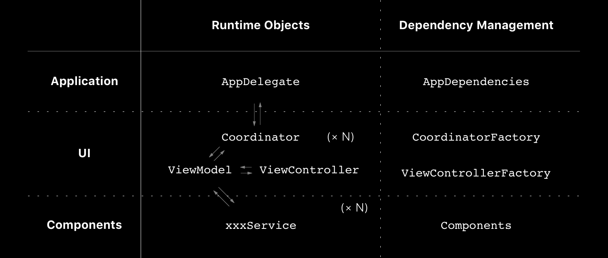

autoscale: true
slidenumbers: true

## App Architecture by Manual DI
### <br><br>@yoshikuni_kato
#### Tokyo iOS meetup<br>2018/07/21

---
# Who am I ?


- Yoshikuni Kato（加藤由訓）
- iOS Engineer（3.5 years）
- Yahoo! Japan -> OHAKO -> Pangea
- Twitter: [@yoshikuni_kato](https://twitter.com/yoshikuni_kato)
- GitHub: [@yoching](https://github.com/yoching)
- Interests: Software Design, FRP (ReactiveSwift), UI Implementation

---
# Agenda

1. Coordinator Pattern
1. Goals
1. Architecture Sample

^ share architecture that I considered and used in production apps at my previous company

^ feedbacks if possible

---
# Coordinator Pattern

^ This is not a main topic of this presentation, but I need extra explanation.

---
# Connecting View Controllers [^1]

```swift
let nc = window?.rootViewController as! UINavigationController
let episodesVC = nc.viewControllers[0] as! EpisodesViewController

let storyboard = UIStoryboard(name: "Main", bundle: nil)

episodesVC.didSelect = { episode in
    let detailVC = storyboard.instantiateViewControllerWithIdentifier("Detail")
                       as! DetailViewController
    detailVC.episode = episode
    nc.pushViewController(detailVC, animated: true)
}
```

- transition logics are **outside** of view controller

[^1]: https://talk.objc.io/episodes/S01E05-connecting-view-controllers

^ not using segue

---
# Coordinator Pattern [^2] [^3]

- Objects to handle view controller transition = Coordinator
- View Controllers can be isolated each other -> DI friendly
- Other names: Router (in VIPER), Wireframe, Navigation, ...

[^2]: https://speakerdeck.com/yoching/hua-mian-qian-yi-falseguan-li-tomvvm

[^3]: https://speakerdeck.com/yoching/coordinatorpatanfalseshi-jian

---
# More commonized way

```swift
// in ViewController
enum EpisodesRoute {
    case detail(Episode)
}
protocol EpisodesRouting: class {
    var routeSelected: ((EpisodesRoute) -> Void)? { get set }
}
class EpisodesViewController: UIViewController, EpisodesRouting {
    var routeSelected: ((EpisodesRoute) -> Void)?
}

// in Coordinator
episodesVC.routeSelected = { route in
    switch route {
    case .detail(let episode):
        // present detail
    }
}
```

(inspired by "Deep Linking at Kickstarter" @ SwiftTalk [^4])

[^4]: https://talk.objc.io/episodes/S01E49-deep-linking-at-kickstarter

---


---
# Coordinator Pattern problems

- 2 tasks in Coordinator
 - view transition
 - view controller creation

- lots of dependencies

---
# Goals

---
# Goals

- All dependencies are injected from outside
   　
- Coordinator doesn't do view controller creation
   　
- Project is well organized
    　

---
# Goals

- All dependencies are injected from outside
  -> Manual DI [^5]
- Coordinator doesn't do view creation
  -> using `ViewFactory`, `CoordinatorFactory`
- Project is well organized
  -> Application / UI / Component [^6]

[^5]: https://ja.wikipedia.org/wiki/%E4%BE%9D%E5%AD%98%E6%80%A7%E3%81%AE%E6%B3%A8%E5%85%A5

[^6]: Minimizing Decision Fatigue to Improve Team Productivity @ try! swift 2017, https://www.slideshare.net/DerekLee/minimizing-decision-fatigue-to-improve-team-productivity

^ Using DI container / libraries is called Automatic DI

^ Manual DI is controllable (like handling singleton)

^ *App / Components / UI* is good not only folder structures, but also for object organization

---
# Architecture Sample

---
# Sample Code

- yoching/iOSAppArchitectureSample [^7]

[^7]: https://github.com/yoching/iOSAppArchitectureSample

^ App behavior
^ Application / Components / UI
^ Components
^ View (MVVM & MVC), Routing, ViewFactory
^ Coordinator, CoordinatorFactory
^ AppDependencies

---
# Figure



^ right column objects are not testable (almost setting file)

^ because of it, left objects are testable (all dependencies are injected)

---
# Development Workflow

| situation | workflow |
| --- | --- |
| make service | make service<br>-> update `Components` |
| make view | make VC & VM <br>-> make function at `ViewFactory` |
| make transition | update `Coordinator` |

<!-- ---
# Result

- Coordinator: only view transition
- Factory & Components: Dependency Injection
- No Singleton😄
- *App / Components / UI* is good for object organizing (not only folder structures) -->

---
# More Practical Sample

- yoching/JSONPlaceholderViewer [^8]

  - persistance using CoreData
  - networking
  - ReactiveSwift

[^8]: https://github.com/yoching/JSONPlaceholderViewer

---
# Discussions

- Over engineered?
- Dependency management objects = DI container?

---
# Thank you!
### <br><br>@yoshikuni_kato
