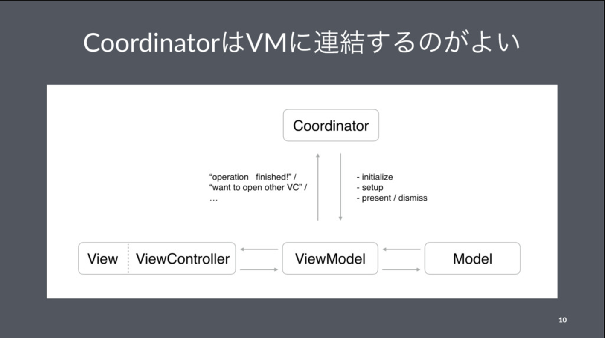
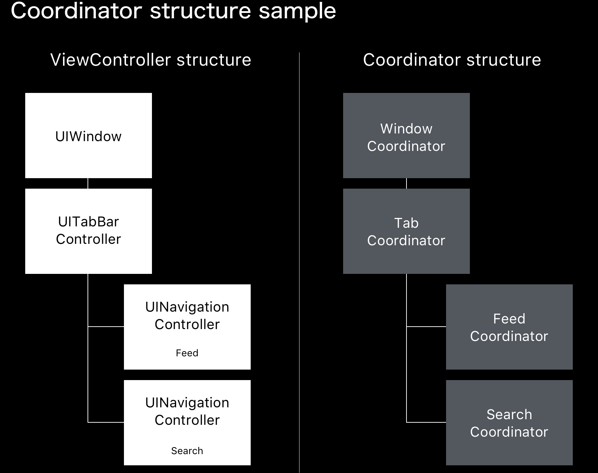
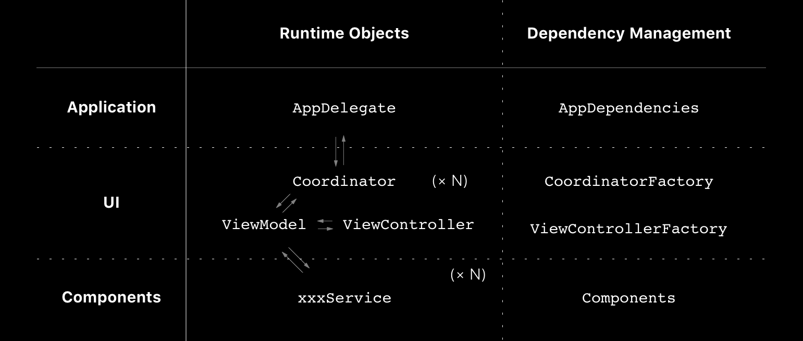

autoscale: true
slidenumbers: true

## App Architecture by Manual DI
###   @yoshikuni_kato
#### Tokyo iOS meetup 2018/07/20

---
# Who am I ?

- Yoshikuni Kato（加藤由訓）
- iOS Engineer（3.5 years）
- Yahoo! Japan -> OHAKO -> Pangea
- Twitter: [@yoshikuni_kato](https://twitter.com/yoshikuni_kato)
- GitHub: [@yoching](https://github.com/yoching)

---
# Self Introduction - Interests

- Software Design
 - App Architecture Patterns
 - Test
 - Functional Reactive Programming (ReactiveSwift)
 - Functional Approach

- UI Implementation
  - AutoLayout (priority / ...)
  - UIStackView
  - UIViewPropertyAnimator
  - Custom Transition

---
## App Architecture by Manual DI

---
# Agenda

1. Coordinator pattern
1. Inspirations
1. Architecture
1. How it changed the development flow?

---
# Sample Code

- yoching/iOSAppArchitectureSample [^2]

[^2]: https://github.com/yoching/iOSAppArchitectureSample

---
# Coordinator pattern [^3]

- Basic idea: extract transition logics from VC
  (do not write `present(UIViewController)`, `pushViewController` **inside** UIViewController)
- Objects to handle transition = Coordinator
- View Controllers can be isolated each other -> DI friendly
- Other names: Router (in VIPER), Wireframe, Navigation, ...

<!-- - With this pattern, View Controllers can be isolated each other -> Dependency Injection -->

[^3]: [Managing view transitions & MVVM](https://speakerdeck.com/yoching/hua-mian-qian-yi-falseguan-li-tomvvm).

<!-- ---
# Coordinator: a way to isolate views

- MVVM-C
  - 画面遷移の管理とMVVM [^3]
  - Coordinatorパターンの実践 [^4]

[^3]: https://speakerdeck.com/yoching/hua-mian-qian-yi-falseguan-li-tomvvm

[^4]: https://speakerdeck.com/yoching/coordinatorpatanfalseshi-jian -->

<!-- ---

https://speakerdeck.com/yoching/hua-mian-qian-yi-falseguan-li-tomvvm -->

---

---
# Coordinator Problems

- 2 tasks in Coordinator
 - View Transition
 - Dependency Injection

- hard to test
- cannot replace with stub objects

---
# Inspirations

- Minimizing Decision Fatigue to Improve Team Productivity @ try! swift 2017 [^5]
  - **Application / UI / Components** (Project Organization)
- Dependency Injection  @ wikipedia [^6]
  - Manual DI / Automatic DI (DI container)
- Deep Linking at Kickstarter @ SwiftTalk [^7]
  - *Routing* logics

[^5]: https://www.slideshare.net/DerekLee/minimizing-decision-fatigue-to-improve-team-productivity

[^6]: https://ja.wikipedia.org/wiki/%E4%BE%9D%E5%AD%98%E6%80%A7%E3%81%AE%E6%B3%A8%E5%85%A5

[^7]: https://talk.objc.io/episodes/S01E49-deep-linking-at-kickstarter

---
# Architecture

---
# 2 Types of Objects

- Runtime Objects
  - several objects for app runtime
  - testable (all dependencies are injected)
- Dependency Management
  - doing Dependency Injection
  - no need to test (like setting file)

---
# Sample Code

- yoching/iOSAppArchitectureSample [^2]

[^2]: https://github.com/yoching/iOSAppArchitectureSample

---
# Development Workflow

| situation | workflow |
| --- | --- |
| make service | make service -> update `components` |
| make view | make VC & VM  -> make function at `ViewFactory` |
| make transition | update `coordinator` |

---
# Result

- Coordinator: only view transition
- Factory & Components: Dependency Injection
- No Singleton😄
- *App / Components / UI* is good for object organizing (not only folder structures)

---
# Thank you!
