autoscale: true
slidenumbers: true

## Swiftエンジニアが 海外のポジションに応募する
###   @yoshikuni_kato
#### Swift愛好会 vol38 @レバレジーズ 2019/02/12

---
# Who am I ?

- Yoshikuni Kato（加藤由訓）
- iOS Engineer（4 years）
- Yahoo! Japan -> OHAKO -> Pangea      -> strv (in Czechia)
- Twitter: [@yoshikuni_kato](https://twitter.com/yoshikuni_kato)
- GitHub: [@yoching](https://github.com/yoching)
- Interests: Software Design, FRP (ReactiveSwift), UI Implementation

---
# Agenda

Swiftエンジニアとして、チェコの現地企業で働くことになったので、転職の体験をシェアします
 

- 海外転職について（便利なツール等含め）
- チェコ、プラハ、strvについて

---
# 🙇🏻‍♂️

- swift愛好会なのにswiftの話少なめ
- The Elm Architectureのswift実装を試し中
  - yoching/SwiftElmButtonSample
  - yoching/SwiftElmSample2

---
# 転職の経緯

2017ごろ US企業は難しそうなので、選択肢としてヨーロッパへ興味を持つ。
↓
2018/05 UIKonf@ベルリンに参加。ヨーロッパはビザ取りやすそうと実感。
↓
広くポジション探し、応募を繰り返す。
↓
2018/12 チェコ🇨🇿の会社よりオファーをもらう。
↓
2019/05ごろ プラハ移住予定。

※ この経験ベースでの話

^ ヨーロッパで、場所のこだわりはそれほど強くないケース

---
# Topics

1. 海外で働く方法いろいろ
1. ポジションを探す
1. 応募するか考える
1. 採用フロー
1. 感想

---
# 海外で働く方法

---
# 海外で働く方法

- 現地企業に直接応募 [^1] ← **今回はこれ**
- 日系企業の海外支社 [^1]
- 大学院留学後、現地採用 [^1]
- 現地でフリーランス
- ワーキングホリデー
- 海外転職支援団体（英語研修やスクール→現地採用？）

[^1]: 竜盛博,『エンジニアとして世界の最前線で働く選択肢』, 2015

---
# ポジションを探す

---
# ポジションを探す - 1

- iOS Developers slack[^2]の `job-board` channel
  - Apple社のポジションもあり
- LinkedIn - 充実させておくと、メッセージが来る
- カンファレンスへの参加
  - 企業ブース、募集ボードなど
  - 知り合いを作る ← **今回はこのケースになった**
  - （非参加でも）協賛企業を調べる

[^2]: https://ios-developers.io/

---
<!-- # iOS Developers slack -->

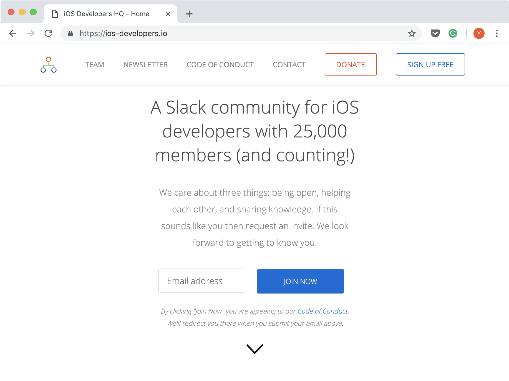

---
# ポジションを探す - 2

- 逆求人サイト
  - HIRED(米)
  - Honeypot(ヨーロッパ、特にベルリン)
    Honeypotがビザサポートしてくれるケースあるらしい
- 求人サイト
  - Relocate.me: 移住サポートありのポジション
  - glassdoor
- 転職エージェント等
  - 日本のエージェントだと「海外案件」をうたっていてもガチ海外ポジションは見つからない

---
# 応募するか考える

---
# 応募するか考える

- 会社を知る
  - Glassdoor: 英語圏だと定番っぽい。企業側が点の高さをアピールしていることも

- 場所を知る
  - Nomad List: 生活費、居住環境等の比較サイト
  - Relocate.me: 移住情報（ビザ、税金、住居等）が充実

---
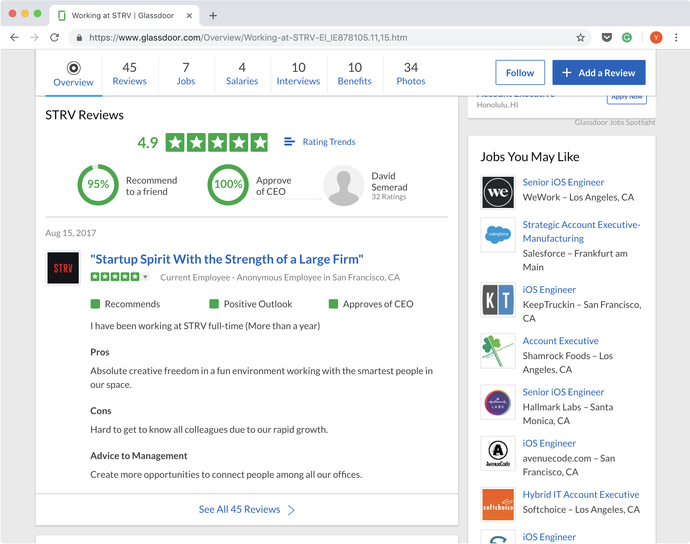

---

---
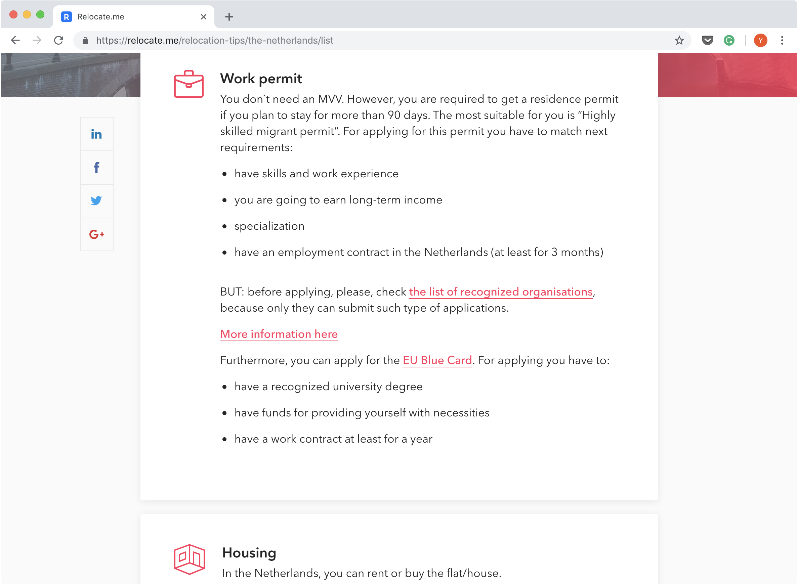

---
# 採用フロー

---
# 採用フロー
日本の会社より、パターンが決まっている印象

  1. 人事（or 採用担当）と軽く話す
  1. 技術テスト
  1. 技術面接
  1. 最終面接（マネージャー等）

---
# 技術テスト

- アプリを作る課題
- 仕様とデザインが与えられる
  - 2~3画面, APIアクセス, Location, Database, ...
- 評価するポイント等は会社による
  - テスタビリティ重視
  - UI実装重視
  - ...

---
# 技術テスト - 例

GitHub等で公開されている技術テスト

- https://github.com/Babylonpartners/iOS-Interview-Demo
- https://github.com/AckeeCZ/cookbook-ios-task

---
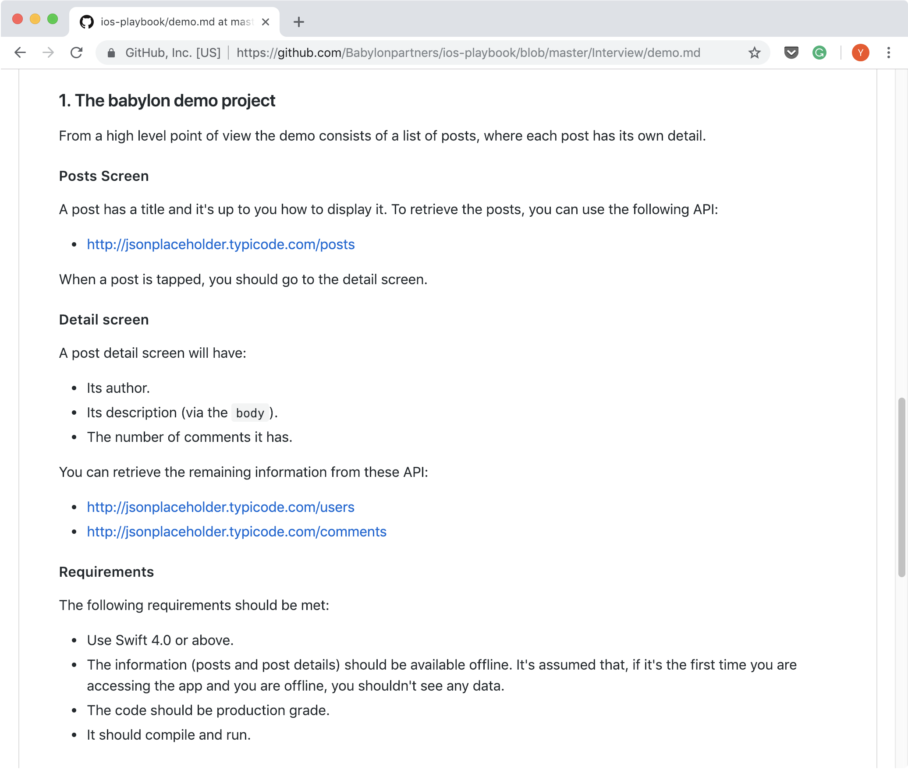

---
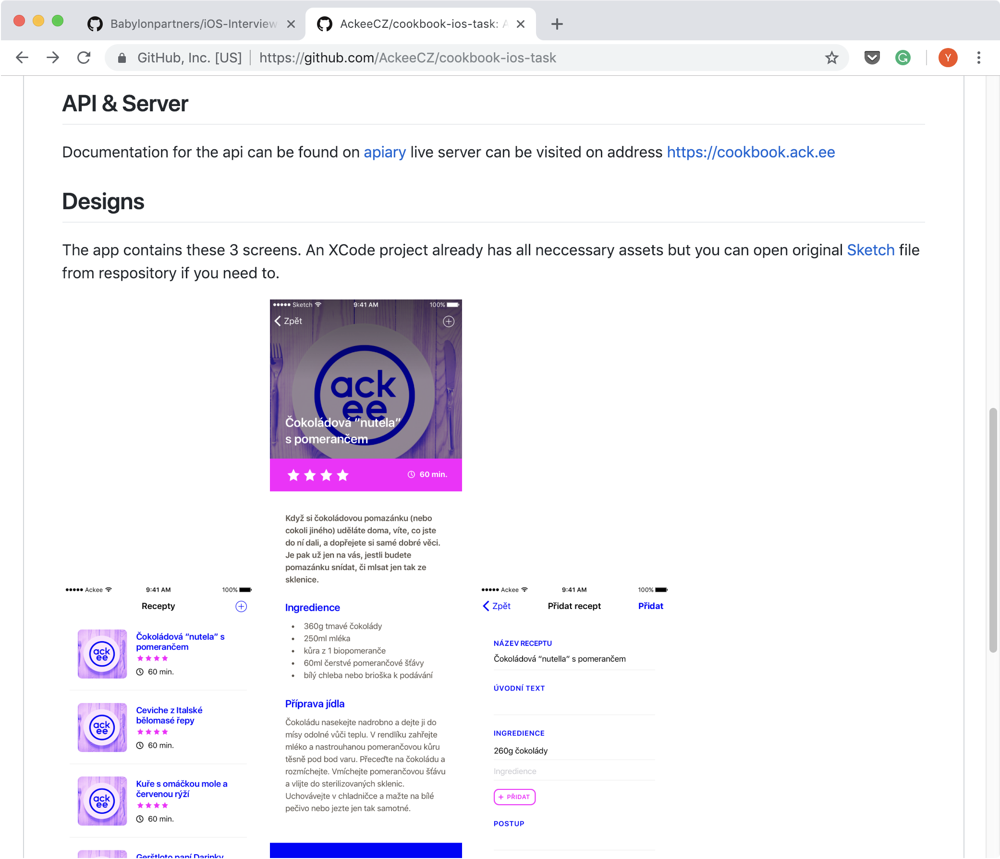

---
# 技術面接

- 技術テストのフィードバック、議論
- 開発に関する質問

---
# 技術面接 - 質問例

- 開発手法
  - Scrum/Agile, スプリントのフロー
  - gitの使い方、github flowのやり方
- プログラミングの原則
  - SOLID原則
  - DI

---
# 技術面接 - iOSの質問例

- Swift
- Database
- UIKit
- Foundation
- Network
- 新しいライブラリ（ARKit, CoreML, ...）

(Babylonの採用情報ページ[^3]を参考にするといいかも)

[^3]: https://github.com/Babylonpartners/iOS-Interview-Demo/blob/master/questions.md

---
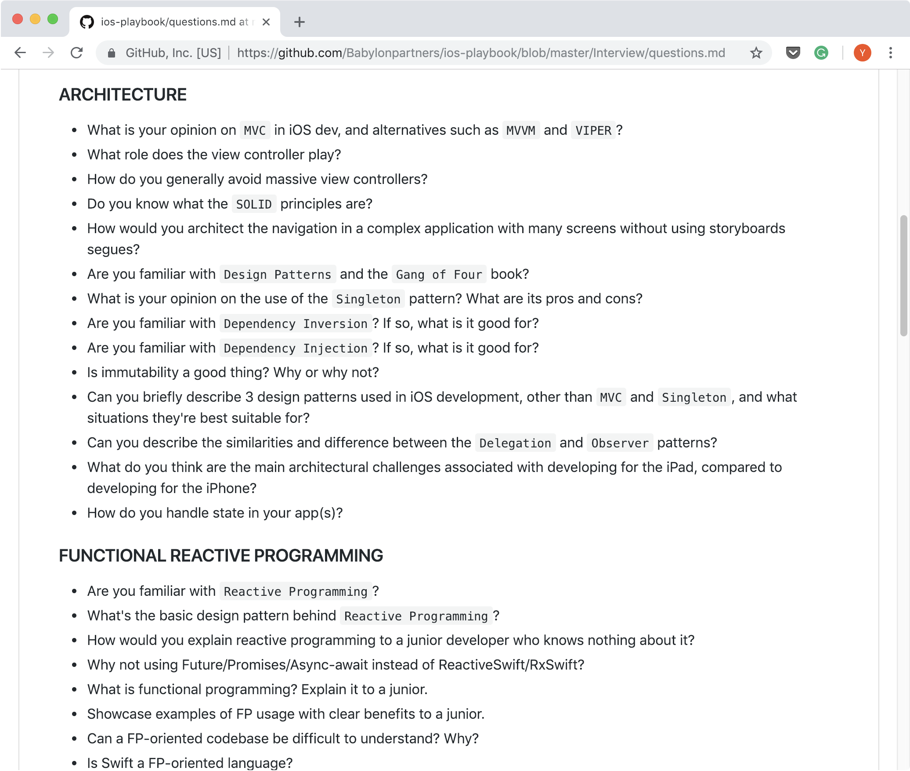

---
# 経験に関する質問例

- Work you're most proud of / 一番誇りに思っている仕事
- Biggest challenges, difficulties / 今までで一番チャレンジングだった仕事
- どういうポジションを探しているか
- Strength & weakness / 強みと弱み
- What motivates you? / 何があるとモチベーションが上がるか

ググるとたくさん出てくるので、**事前に回答を準備しておくことが大事**

---
# 面接の練習サービス

- Pramp (https://www.pramp.com)
- 面接の練習を行う2人がマッチングされる
- 1回使用したが、とてもいい練習になった
- Qiita記事[^4]で知った

[^4]: 英語のコーディング面接 (React) を受けた感想、やっておけば良かったと思ったことなど, https://qiita.com/acro5piano/items/df53d695c84db83061da

<!-- ---
# その他、ツール
- calendly
  - 予定合わせツール
  - スロットを選ぶ（時差が考慮されている）→ GoogleCalendarに自動で予定登録
- Google Hangout -->

<!-- ---
# 就労ビザについて

strvは、フリーランスビザを取ってそれで契約する。
フリーランスビザを取るのに、住所の指定など、面倒な手続きがいくつかあるが、それをサポートしてくれる。 -->

<!-- ---
# 自分の要望の狭さ

- 受託開発
- iOSの技術力高い（トレンドを追っている）
- 厚めのビザ・移住サポート（海外経験が少ないため）
- 言語（日本語、不十分な英語） -->

<!-- - Swift only (No Objective-C)
- 小さめの会社 -->

<!-- ---
# うまく行かなかったケース

- 技術テスト通らない
- がんばってカバーレター書いたのに返信がない
- 勤務地が希望と合わない
- 非英語サービスの開発
- 転職エージェント（ポジション見つからない）
- 日本で働いている外国人に聞く -->

---
# 感想

---
# 海外の会社を探すのは大変 - 1

- 業界が分からない
  - 日本のWeb業界なら、会社規模、会社の技術力等なんとなく分かるが・・・
  - 特に、ヨーロッパのサービスは日本に来ていないものも多い
  - web上の情報のみからでは判断できない
  - 気軽に勉強会に行ったり会社を見に行ったりできない（距離）

---
# 海外の会社を探すのは大変 - 2

- 非英語圏の難しさ
  - 英語（仕事）+現地語（生活）が必要
  - 非英語サービスに携われる気がしない
  - とはいえ、英語圏は限られる

---
# 海外の会社を探すのは大変 - 3

- その他
  - ビザや移住のサポートがあるか
  - 未踏の地に行くのは不安
  - 英語力（特に受託開発の場合）
  - 応募したのに返信来ない

 

→ 途方に暮れることしばしば。

---
# 効果的だったこと

- 英語でアウトプットしておく
  - Tokyo iOS meetup[^5]での発表の動画[^6]を、会社の人が見てくれていた
  - SpeakerDeckの英語資料も
- LinkedInのProfileを整理する

[^5]: https://www.meetup.com/TokyoiOSMeetup/

[^6]: https://www.youtube.com/watch?v=Z3tiYtq5oio

<!-- ---
# 英語について

- 今の会社は英語でコミュニケーション
- + 英会話、自主勉強
- 技術の話は簡単。それ以外が難しい。
- Grammarly使ってる（けどどうなんでしょう・・・） -->

<!-- ---
# twitter

日本語で情報発信している海外転職エンジニア多い。
チェコについて発信している人いない
→ twitterは狭い世界？ -->

<!-- ---
# Swift Elm

- 最近作っているので、興味あればご覧ください -->

---
# チェコ、プラハ、STRV

---
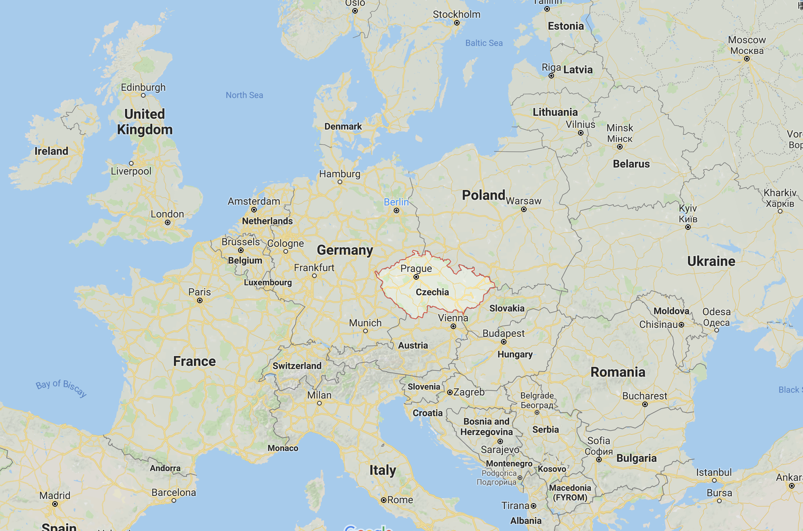

<!-- ---
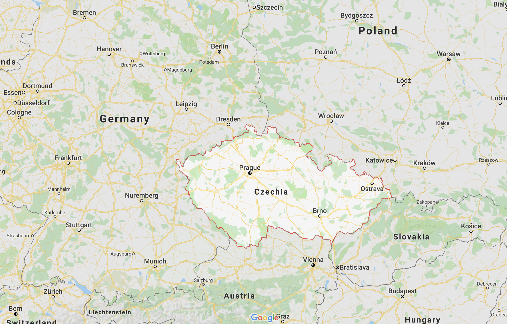 -->

---
# チェコ共和国🇨🇿

- 首都：プラハ
- 公用語：チェコ語（難しい） ※ プラハだと英語も割と通じる
- 通貨：コルナ（1コルナ ≒ 5円）
- 生活費が安い（プラハでは東京の6割程度か）
- ビール🍺の消費量（一人あたり）世界一、そして安い
- ヨーロッパの中央にあるので、どこでも行きやすい

<!-- - 人口：10,369,000人 -->

---
# プラハ

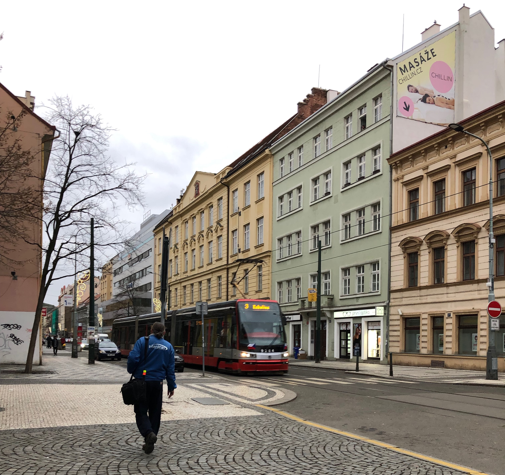

- 「美しい街」
- 景色のいい公園多い
  - 外で🍺飲んだら気持ちよさそう
- 外国人増えているらしい
- 冬は厳しい　→
  - 寒い
  - 日照時間短い

---
# チェコ - IT

<!-- 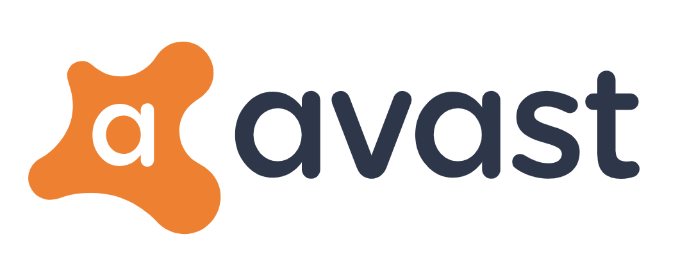
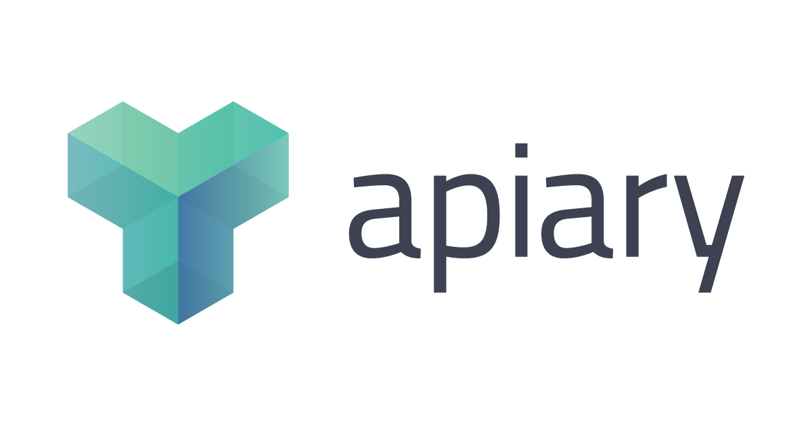 -->

- Avast Antivirus
- JetBrains (IDEs, Kotlin, ...) Headquarters
- apiary: API documentation tool

---
# Mobile Dev Conferences

---
# STRV

- サービスのデザイン＆開発
- 今のクライアントは主に米企業（大企業〜スタートアップまで）
- 200人程度
- 開発環境はよさげ
- 外国人Welcomeな雰囲気
  - Visa & Relocation support
  - 英語とチェコ語のレッスン
- プラハとブルノに開発拠点
- 気になる方はサイトのキャリアページなど

<!-- ---
# チェコの日本人

- チェコ内に2000人程度
- 日系企業の支社はあるらしい
- Web系の日本人エンジニア/デザイナー、本当に見つからない・・・（ベルリンにはたくさんいるのに・・・） -->

---
# 最後に

- 外国で働きたい人の参考になれば
- プラハで働きたい人Welcome!
- チェコ＆プラハ情報あったら教えてください🙇🏻‍♂️

^ - Web系の日本人エンジニア/デザイナー、本当に見つからない・・・（ベルリンにはたくさんいるのに・・・）

---
# Thank you!🇨🇿
