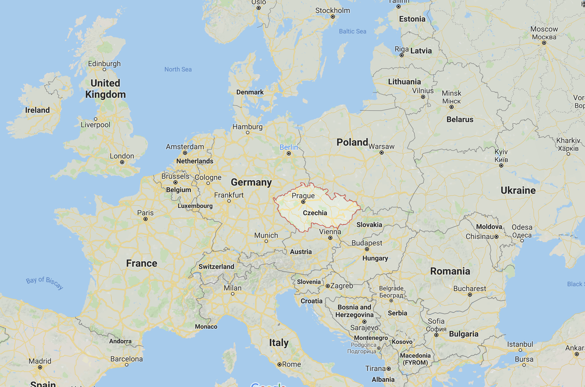
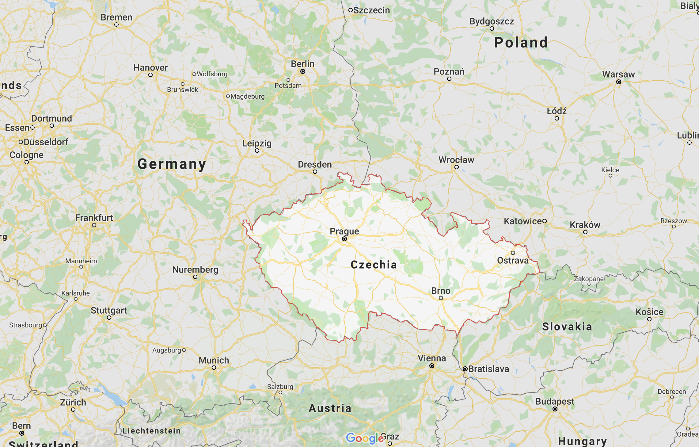
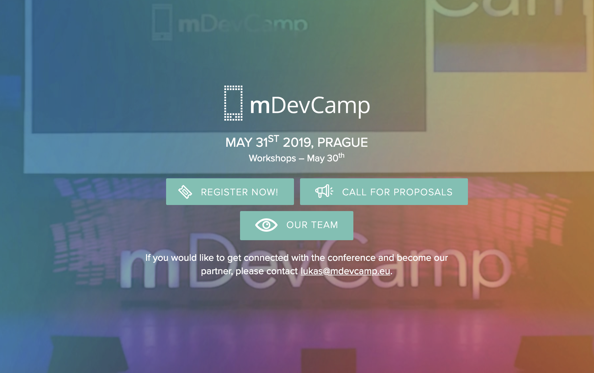

autoscale: true
slidenumbers: true

## Swiftエンジニアが 海外のポジションに応募する
###   @yoshikuni_kato
#### Swift愛好会 2019/02/12

---
# Who am I ?

- Yoshikuni Kato（加藤由訓）
- iOS Engineer（4 years）
- Yahoo! Japan -> OHAKO -> Pangea      -> strv (in Czechia)
- Twitter: [@yoshikuni_kato](https://twitter.com/yoshikuni_kato)
- GitHub: [@yoching](https://github.com/yoching)
- Interests: Software Design, FRP (ReactiveSwift), UI Implementation

---
# Agenda

Swiftエンジニアとして、チェコの現地企業で働くことになったので、転職の体験をシェアします。

- 海外転職について
  - 海外で働く方法いろいろ
  - ポジションを探す
  - 採用フロー（技術テスト、技術面接、経験に関する質問）
  - 困難
- チェコ、プラハ、strvについて

<!-- - 採用フローは結構共通化されてる
  - 困難多い -->

---
# 転職の経緯

2017ごろ US企業は難しそうなので、選択肢としてヨーロッパへ興味を持つ。
↓
2018/05 UIKonf@ベルリンに参加。ヨーロッパはビザ取りやすそうと実感。
↓
広くポジション探し、応募を繰り返す。
↓
2018/12 チェコの会社よりオファーをもらう。
↓
2019/05ごろ プラハ移住予定。

---
# おことわり

- 自分の経験の中で得たことベース

---
# 海外転職について

<!-- ---
# Agenda

- 海外で働く方法いろいろ
- ポジションを探す
- 採用フロー
  - 技術テスト
  - 技術面接
  - 経験に関する質問
- 困難 -->

---
# 海外で働く方法いろいろ

- 大学院留学後、現地採用 [^1]
- 日系企業の海外支社 [^1]
- 現地企業に直接応募 [^1] ← 今回はこれ
- 現地でフリーランス
- ワーキングホリデー
- 海外転職支援団体（英語研修やスクール→現地採用？）

[^1]: 竜盛博,『エンジニアとして世界の最前線で働く選択肢』, 2015

---
# ポジションを探す

- iOS Developers slack, `job-board` channel (Appleのポジションとかもある)
- LinkedIn
  - 充実させておくと、たまにメッセージが来る
- 海外の求人サイト（Honeypot, Relocate.me）
- 海外のカンファレンスに行く
  - 企業ブース、募集ボードなど
  - 知り合いを作る ← 今回はこのケースになった
- カンファレンスの協賛企業を調べる
- 転職エージェント

---
# 知る

## 会社を知る
Glassdoorよく使われる。

## 場所を知る
Nomad List
Relocate.me

---
# 採用フロー
日本より、パターンが決まっている印象。

  1. 人事（or 採用担当）と軽く話す
  1. 技術テスト
  1. 技術面接
  1. 最終面接（マネージャー等）

---
# 技術テスト例
  - https://github.com/Babylonpartners/iOS-Interview-Demo
  - https://github.com/AckeeCZ/cookbook-ios-task

  - APIアクセス
  - 数画面
  - Location (おそらくAppleのFrameworkの例として)
  - DB

---
# 技術面接例

- Scrum / Agile
  - スプリントのフローについて説明
- SOLID原則
- iOSの技術詳細
  - 本当に細かい

---
# 経験に関する質問

- Most proud of
- Strength / weakness

- (採用の練習サービス使うと出てくる)

---
# よく使うツール
- Calendar
- Google Hangout

<!-- ---
# 便利そうなサービス
  - 面接練習のやつ
  - relocate.me
  - Nomad List -->

---
# 就労ビザについて

strvは、フリーランスビザを取ってそれで契約する。
フリーランスビザを取るのに、住所の指定など、面倒な手続きがいくつかあるが、それをサポートしてくれる。

---
# 困難

- 企業の感覚が分からない（距離の遠さ）
- 語学
- 非英語圏
- 土地勘
- 途方に暮れることしばしば

---
# 自分の要望の狭さ

- 受託開発
- iOSの技術力高い（トレンドを追っている）
- 厚めのビザ・移住サポート（海外経験が少ないため）
- 言語（日本語、不十分な英語）

<!-- - Swift only (No Objective-C)
- 小さめの会社 -->

---
# うまく行かなかったケース

- Sydney
- ロンドンの医療系企業
- ヨーロッパの受託会社
- 逆指名求人サイト
- 転職エージェント
- 日本で働いている外国人に聞く

---
# 英語

- 今の会社は英語ベース
- + 英会話、自主勉強
- 技術の話は簡単。それ以外が難しい。

<!-- ---
# twitter

日本語で情報発信している海外転職エンジニア多い。
チェコについて発信している人いない
→ twitterは狭い世界？ -->

---
# チェコ & プラハについて

---

<!-- ---
 -->

---
# チェコ共和国

- 首都：プラハ
- 人口：10,369,000人
- 公用語：チェコ語（難しい） ※ プラハだと英語も割と通じる
- 通貨：コルナ（1コルナ ≒ 5円）
- 生活費が安い（プラハでは東京の6割程度か）
- ヨーロッパの中央にあるので、どこでも行きやすい

---
# チェコ - IT

- Avast Antivirus
- JetBrains (IDEs, Kotlin, ...)
- apiary: API documentation tool

---
# Mobile Dev Conferences

---
# プラハ

- 首都
- 「中世の宝石」

---
# strv

- 米企業（大企業〜スタートアップ）の受託開発
- 200人程度
- 環境はよさげ
- 外国人Welcomeな雰囲気（Visa sponsorship, relocation support, 英語とチェコ語のレッスン）、実際移住する人多い。
- 気になる方はサイトのキャリアページなど

---
# プラハの日本人

- twitter等で発信している日本人エンジニア/デザイナー、本当に見つからない・・・（ベルリンにはたくさんいるのに・・・）
- チェコ内に2000人程度
- 日系企業の支社はあるらしい。

---
# 最後に

- プラハで働きたい人 Welcome!
- チェコ＆プラハ情報あったら教えてください

---
# Thank you!

---
# 以下ドラフト

---
- 海外で仕事を探すのは予想より大変

    - 企業の感覚が分からない
    - 語学
    - 非英語圏
    - 土地勘

- 狭い選択肢
    - 受託 & デザインイケてる & あまりコンサル寄りでない
    - swift only
    - 海外経験

- 長期計画、少しずつ

- うまく行かなかったケース
    - Sydney
    - ロンドンの医療系企業
    - ヨーロッパの受託会社
    - 逆指名求人サイト
    - 転職エージェント

- よく聞かれる質問

- 面接の練習サイト

- 採用フロー
    - 技術テスト⭐️

- チェコとは
    - 場所
    - IT企業
    - ビール
    - 言語

- strvとは

- "海外"

- 便利そうなサイト、他サービス

- 今後も何が起こるか不明

- 移住

- 他都市の話

- Glassdoor
