autoscale: true
slidenumbers: true

## The Elm Architecture & Swift
### <br><br>@yoshikuni_kato
#### event and date: TBD

---
# Who am I ?


- Yoshikuni Kato
- iOS Engineer（5+ years）
- (Some companies in Japan) -> STRV (since 03.2019)
- Twitter: [@yoshikuni_kato](https://twitter.com/yoshikuni_kato)
- GitHub: [@yoching](https://github.com/yoching)
- Interests: Functional Programming, Software Design, UI Implementation

---
# Agenda
- Why Elm?
- TEA experiments by Swift developers & me
- Simple TEA implementation in Swift
- Architecture After SwiftUI

TEA = The Elm Architecture

---
# Why Elm?

---
# What are Elm & TEA?
- Elm: functional language for web apps
- The Elm Architecture (TEA)
  - GUI app architecture for Elm

---
# SwiftUI & Elm

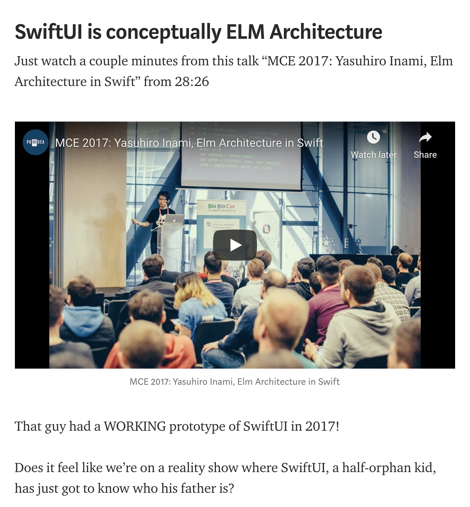

- SwiftUI resembles Elm
cf.) Clean Architecture for SwiftUI [^1]

- Both use virtual views
- Some experiments by Swift developers since 2017
(longer than SwiftUI)
- Knowing Elm & TEA brings us insight into SwiftUI

[^1]: https://medium.com/swlh/clean-architecture-for-swiftui-6d6c4eb1cf6a

---
## TEA experiments by Swift developers & me

---
# TEA experiments by Swift developers & me

(This is from my perspective)

2017 Inami presentations, gist about Elm inspired frameworks
2018 May: AppArchitecture book
2018 June: WWDC - no updates about virtual UI
2018 Dec: my experiments
2019 June: SwiftUI came

---
# Presentations by Inami, 2017

- Making Elm with Swift, 03.2017 [^2]

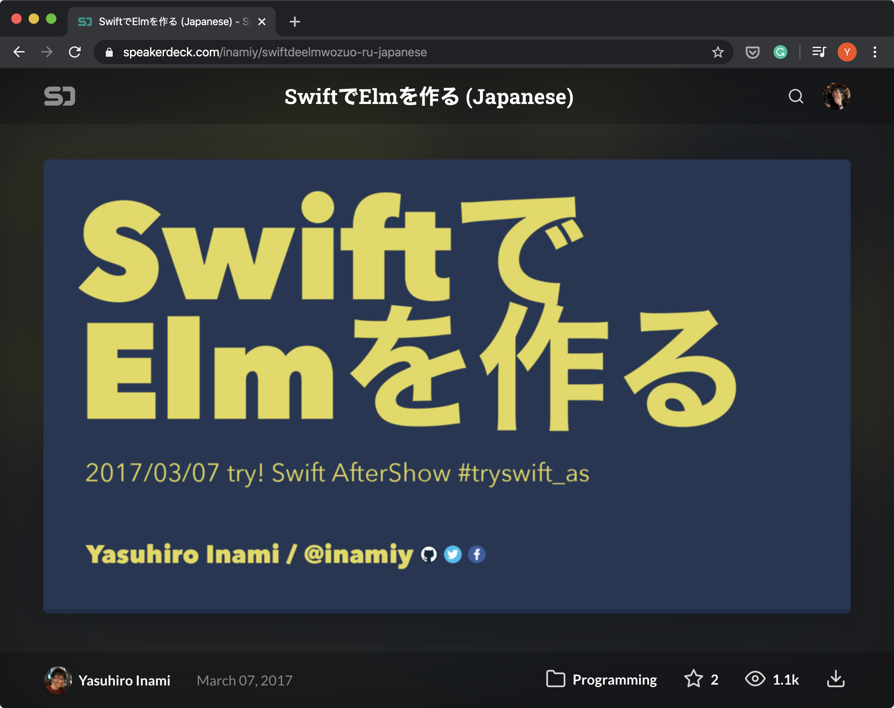

[^2]: https://speakerdeck.com/inamiy/swiftdeelmwozuo-ru-japanese

---
# Presentations by Inami, 2017

- Elm Architecture in Swift, 05.2017 [^3]

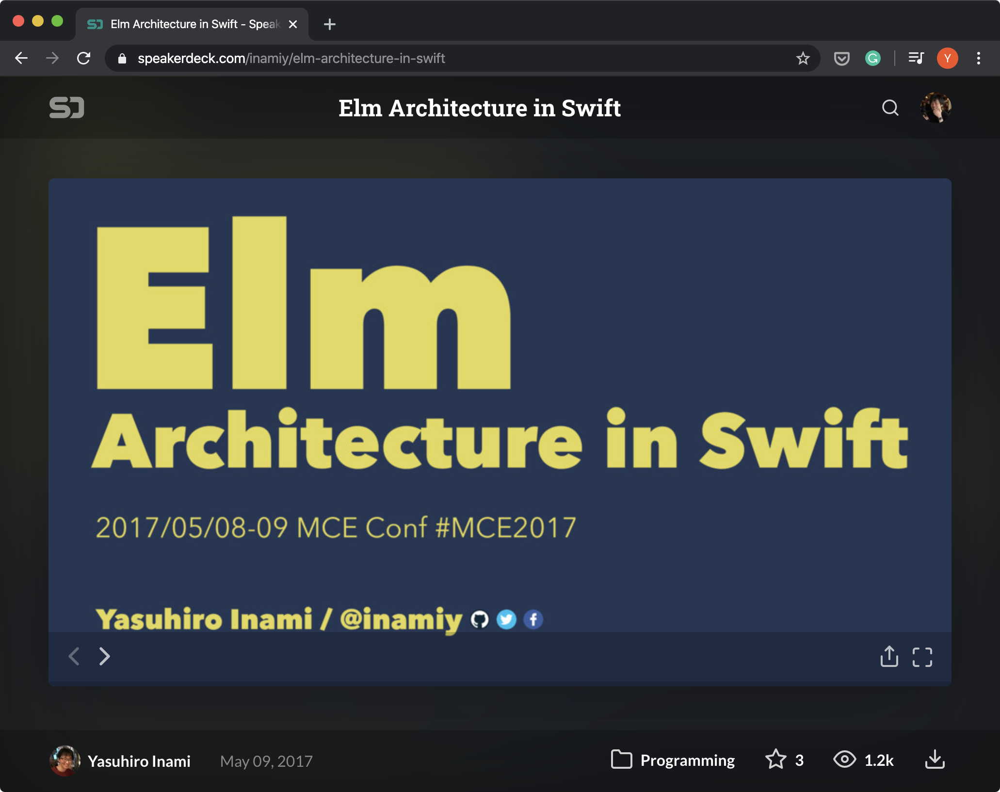

[^3]: https://speakerdeck.com/inamiy/elm-architecture-in-swift

---
# Curated list by Inami, 2017

- React & Elm inspired frameworks in Swift [^4]

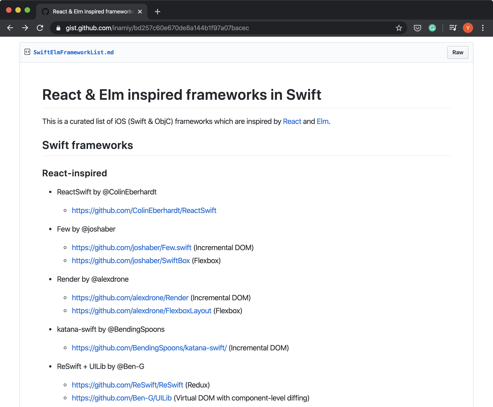

[^4]: https://gist.github.com/inamiy/bd257c60e670de8a144b1f97a07bacec

---
# App Architecture from objc.io, 2018 [^5]

- This was released in May 2018.

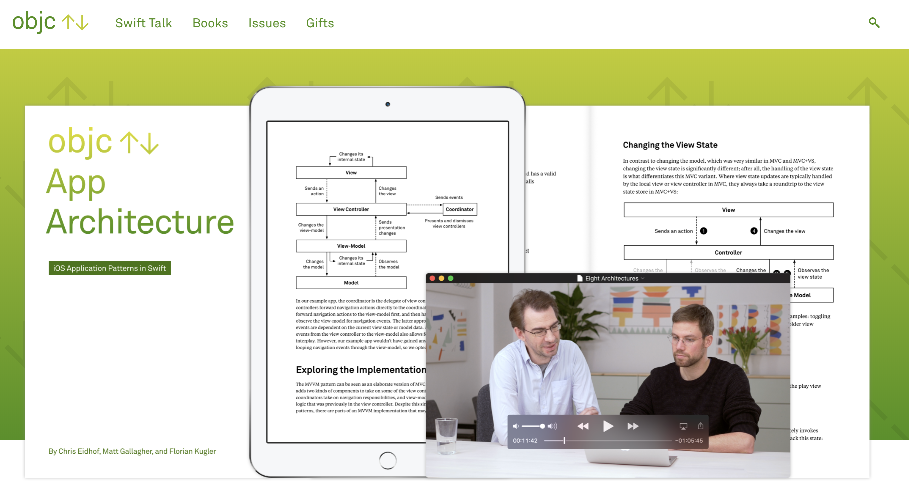

[^5]: https://www.objc.io/books/app-architecture/

---
# App Architecture from objc.io, 2018 [^5]

- The Elm Architecture as an experimental architecture

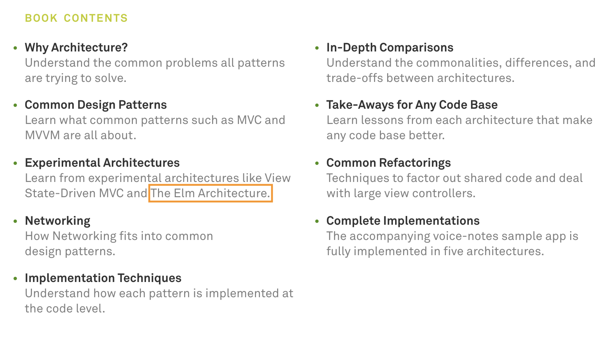

---
# App Architecture from objc.io, 2018 [^5]

- some Video Contents

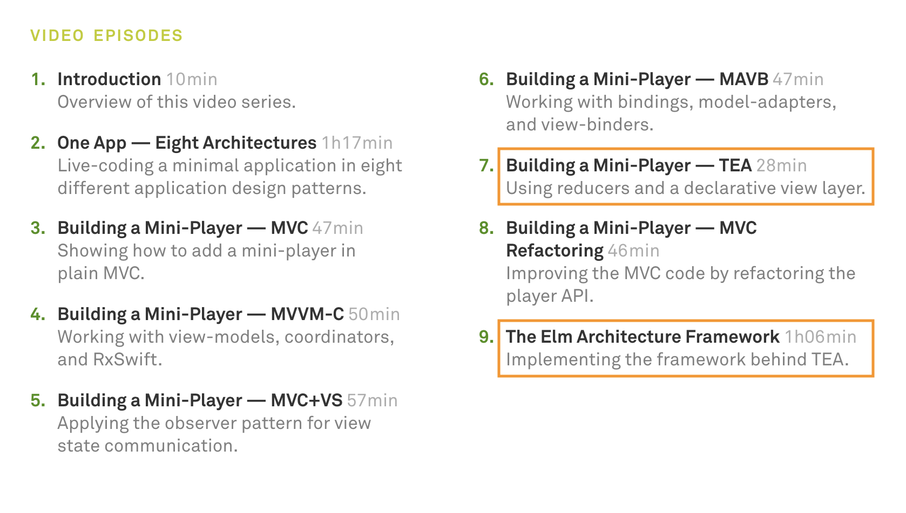

---
# My wish before WWDC18

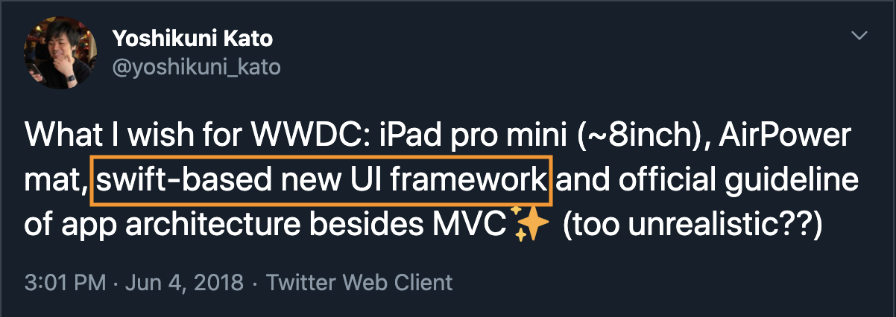

---
# WWDC18

- no new UI framework
- only updates about UIKit
- 🤔Apple won't make a new UI library, they'll stick to UIKit?


---
# My trials to understand TEA

- TEA sample from objc.io was a bit difficult for me to understand. Tried to understand them by making them.
- yoching/SwiftElmButtonSample [^6]
- yoching/SwiftElmSample2 [^7]
- mostly done in 12.2018

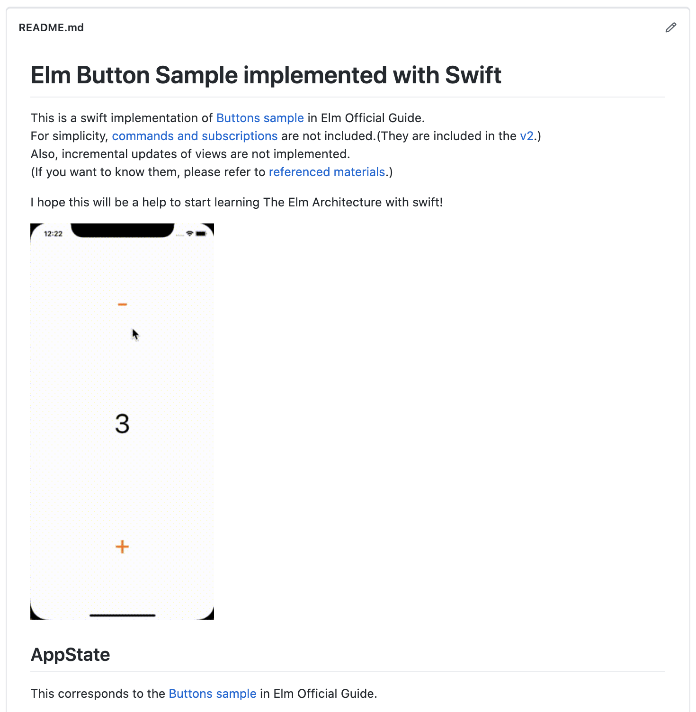

[^6]: https://github.com/yoching/SwiftElmButtonSample

[^7]: https://github.com/yoching/SwiftElmSample2

---
# WWDC19

- SwiftUI came suddenly
- 🤔This is how it should be (e.g. React), but it's one year later than expected.

---
# TEA implementation

<!-- ---
# What is Elm & TEA
- Elm: functional language for web apps
  - Haskell-inspired syntax
- The Elm Architecture
  - GUI app architecture for Elm -->

<!-- ---
# Virtual view in Inami's Elm

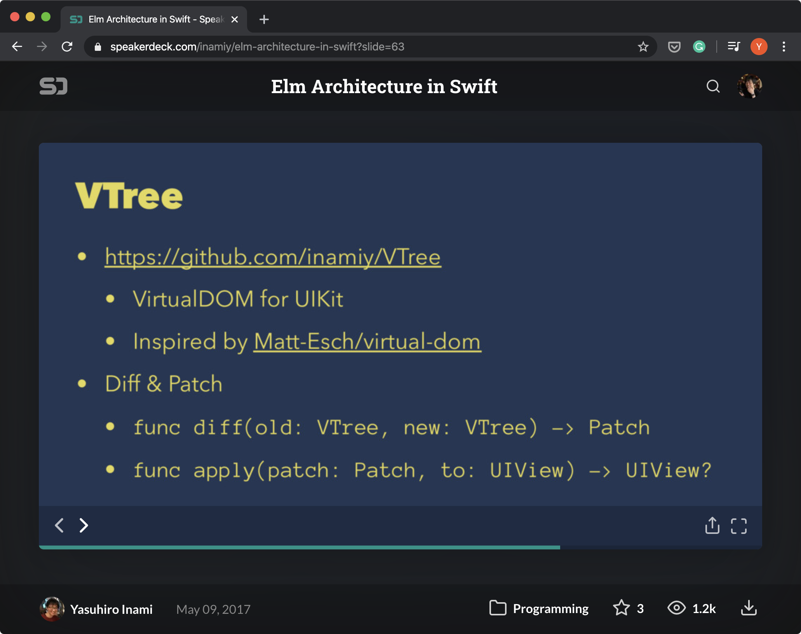 -->

---
# TEA sample
```elm
-- MODEL
type alias Model = Int
init : Model
init = 0

-- UPDATE
type Msg = Increment | Decrement

update : Msg -> Model -> Model
update msg model =
  case msg of
    Increment -> model + 1
    Decrement -> model - 1
```

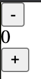

---
# TEA sample
```elm
-- VIEW
view : Model -> Html Msg
view model =
  div []
    [ button [ onClick Decrement ] [ text "-" ]
    , div [] [ text (String.fromInt model) ]
    , button [ onClick Increment ] [ text "+" ]
    ]
```


---
# 1st sample in Swift
```swift
struct AppState {
    // MODEL
    var value: Int

    // UPDATE
    enum Message { case increment, decrement }
    mutating func update(_ message: Message) {
        switch message {
        case .increment: value = value + 1
        case .decrement: value = value - 1
        }
    }

    ...
```

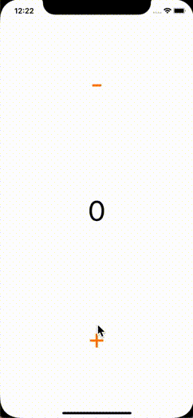

---
# 1st sample in Swift
```swift
    ...

    // VIEW
    var viewController: ViewController<Message> {
        return ._viewController(
            .stackView(
                views: [
                    .button(text: "-", onTap: .decrement),
                    .label(text: "\(value)"),
                    .button(text: "+", onTap: .increment)
                ],
                axis: .vertical,
                distriburtion: .fillEqually
            )
        )
    }
}
```


---
# Virtual Views
```swift
indirect enum ViewController<Message> {
    case _viewController(View<Message>)
}

indirect enum View<Message> {
    case _label(Label)
    case _button(Button<Message>)
    case _stackView(StackView<Message>)
    ...
}
```

- e.g. Virtual DOM (React)
- (SwiftUI is basically virtual view)

---
# 2nd sample: Cmd & Subscription
1st sample + save/load

- Save button: save the value to UserDefaults (= side effect without callback)
- Load button: load the value from UserDefaults (= side effect with callback)
- Load value when app becomes active
- Save value when app enters background

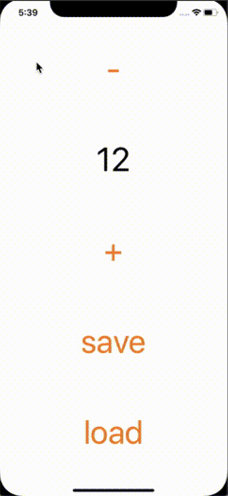

---
# 2nd sample: Cmd & Subscription
```swift
struct AppState {

    // MODEL
    var value: Int

    // UPDATE
    enum Message {
        case increment
        case decrement
        case save
        case load
        case loaded(Int)
    }

    ...
```

---
# 2nd sample: Cmd & Subscription

```swift
// VIEW
var viewController: ViewController<Message> {
    return ._viewController(
        .stackView(
            views: [
                .button(text: "-", onTap: .decrement),
                .label(text: "\(value)"),
                .button(text: "+", onTap: .increment),
                .button(text: "save", onTap: .save),
                .button(text: "load", onTap: .load)
            ],
            axis: .vertical,
            distribution: .fillEqually
        )
    )
}
```

---
# 2nd sample: Cmd & Subscription
```swift
mutating func update(_ message: Message) -> [Command<Message>] {
    switch message {
    case .increment:
        value = value + 1
        return []
    case .decrement:
        value = value - 1
        return []
    case .save:
        return [.save(value: value)]
    case .load:
        return [.load(available: { .loaded($0) })]
    case .loaded(let value):
        self.value = value
        return []
    }
}
```

- need to prepare custom commands

---
# 2nd sample: Cmd & Subscription

```swift
// SUBSCRIPTIONS
var subscriptions: [Subscription<Message>] {
    return [
        .notification(
            name: UIApplication.didBecomeActiveNotification,
            { notification -> Message in
                return .load
        }),
        .notification(
            name: UIApplication.willResignActiveNotification,
            { notification -> Message in
                return .save
        })
    ]
}
```

- need to prepare custom subscriptions

---
# Similarities with SwiftUI
- Data Flow Through SwiftUI @ WWDC19 [^8]

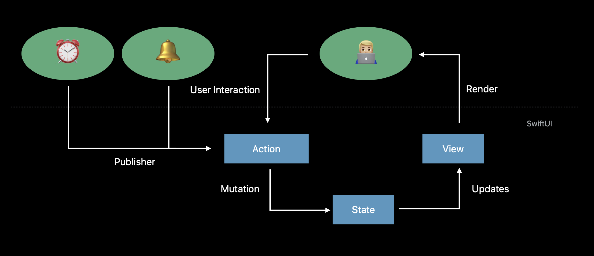

[^8]: https://developer.apple.com/videos/play/wwdc2019/226/

---
# Similarities with SwiftUI
- Data Flow Through SwiftUI @ WWDC19 [^8]

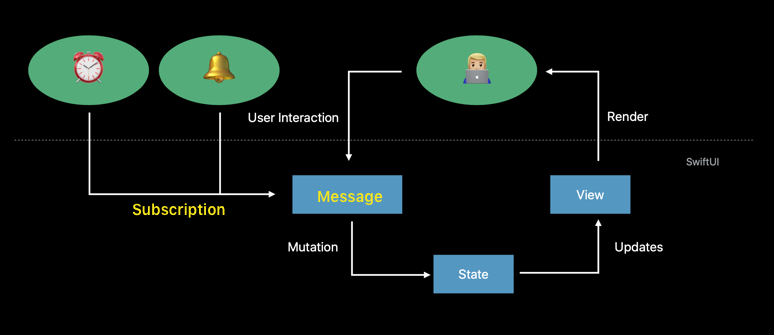

---
# Architecture After SwiftUI

---
# SwiftUI + TEA
- rizumita/Selm
- pointfreeco/swift-composable-architecture

---
# The Composable Architecture (TCA)
- from point-free
- inspired by TEA apparently
- high quality
- Effect is very close to Cmd in TEA
- 🙂Finally TEA came to reality. It's no more "experimental" architecture

---
# Common factor in new architecture: Enum based actions

- In new architecture, actions are often represented as **types** (usually enum)
  - e.g.) actions are represented as **functions/methods** in other architectures like MVC, MVVM
  - easier to test, easier to handle because they are value types
- Lots of architecture going towards this direction

---
# Comparison with other architecture

| Architecture | Enum based Action | Virtual View |
| --- | --- | --- |
| MVVM + UIKit | - | - |
| MVVM + SwiftUI | - | ✅ |
| Redux (XxxFeedback) + UIKit | ✅ | - |
| Redux (XxxFeedback) + SwiftUI | ✅ | ✅|
| TEA (or TCA) | ✅| ✅|

---
# Summary

- We can learn a lot from TEA
- Let's try making enum based actions

---
# Thank you!

### <br><br>@yoshikuni_kato
